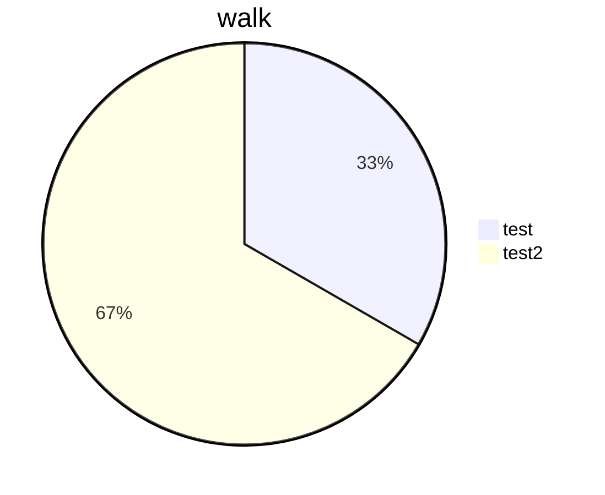

test test test

`a_new_function_for_an_exercise_2`[<sup id="Zm9Mwz">↓</sup>](#f-Zm9Mwz)

<br/>

<br/>

<br/>

<!--MERMAID {width:100}-->

<!--MCONTENT {content: "pie title `walk`[<sup id=\"1O201p\">↓</sup>](#f-1O201p)<br/>\n\"test\":1<br/>\n\"test2\": 2"} --->

<br/>

<br/>

<br/>

<!-- THIS IS AN AUTOGENERATED SECTION. DO NOT EDIT THIS SECTION DIRECTLY -->
### Swimm Note

<span id="f-Zm9Mwz">a_new_function_for_an_exercise_2</span>[^](#Zm9Mwz) - "amnon/pylint-report.py" L41
```python
def a_new_function_for_an_exercise_2():
```

<span id="f-1O201p">walk</span>[^](#1O201p) - "amnon/pylint-report.py" L28
```python
def walk(path, excludes=None):
```

<br/>

This file was generated by Swimm. [Click here to view it in the app](https://swimm-web-app.web.app/repos/Z2l0aHViJTNBJTNBdGVzdC1naXRodWItYXBwJTNBJTNBc3dpbW1pbw==/docs/9rob9).